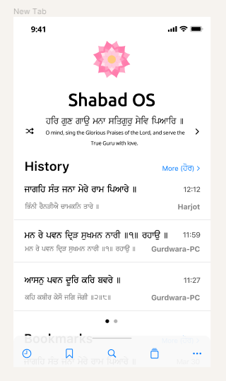
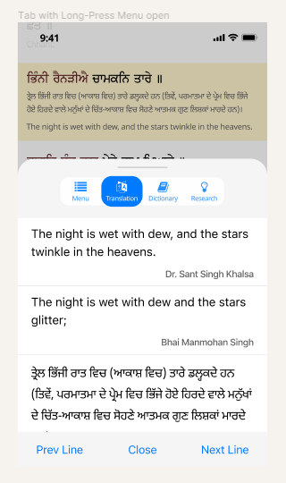

:repo: mobile
:project: Shabad OS for Mobile
:idprefix:
:hide-uri-scheme:
:numbered:
:max-width: 900px
:icons: font
:toc: macro
:toclevels: 4
:logo: https://raw.githubusercontent.com/ShabadOS/desktop/dev/resources/icon.png
:website: https://shabados.com
:contributors-url: https://github.com/shabados/{repo}/graphs/contributors
:instagram-img: https://img.shields.io/badge/Instagram-%40shabad__os-C13584.svg
:instagram-url: https://www.instagram.com/shabad_os/
:twitter-img: https://img.shields.io/badge/Twitter-%40shabad__os-1DA1F2.svg
:twitter-url: https://www.twitter.com/shabad_os/
:chat-img: https://img.shields.io/badge/Chat-Public%20Slack%20Channels-1264a3.svg
:chat-url: https://chat.shabados.com
:wa-img: https://img.shields.io/badge/WhatsApp-%2B1%20516%20619%206059-128C7E.svg
:wa-url: https://wa.me/15166196059
:cci-img: https://img.shields.io/circleci/project/github/ShabadOS/{repo}.svg
:cci-url: https://circleci.com/gh/ShabadOS/{repo}
:license-img: https://img.shields.io/github/license/ShabadOS/{repo}.svg
:license-url: https://github.com/ShabadOS/{repo}/LICENSE.adoc
:runkit-url: https://npm.runkit.com/gurmukhi-utils
ifdef::env-github,env-browser[:outfilesuffix: .asciidoc]
ifdef::env-github[]
:note-caption: :information_source:
:tip-caption: :bulb:
:important-caption: :fire:
:caution-caption: :warning:
:warning-caption: :no_entry:
endif::[]

image::{logo}[128,128,link="{website}"]

[discrete]
# {project}

Android and iOS app for searching, navigating, and presenting the Shabad OS database.

image:{license-img}[title=license, link="{license-url}"] image:{cci-img}[title=CircleCI, link="{cci-url}"]

toc::[id="toc"]

## Introduction

{project} is a GPL-licensed open source project with ongoing development, project management, and marketing made possible entirely by the support and dedication of unpaid volunteers.

### Features in Development

This app is in development. The initial goal is to include online/offline search, synced bookmarks, history, tabs, and navigation controls.

### Figma/Mockup Screenshots

NOTE: These images do not come from the app. The design and layout may differ when the app is released.

### Community

Get updates on {project} and chat with the project maintainers and community members.

* image:{instagram-img}[title=Instagram, link="{instagram-url}"] Follow Shabad OS on Instagram. 
* image:{twitter-img}[title=Twitter, link="{twitter-url}"] Follow Shabad OS on Twitter. 
* image:{chat-img}[title=Chat, link="{chat-url}"] Join the official Slack channel. 
* image:{wa-img}[title=WhatsApp, link="{wa-url}"] Direct message us on WhatsApp. Or chat with fellow Shabad OS community members in the WhatsApp group chat.

## Contributing

There are many ways in which people can participate in the {project} project. For example:

* link:https://github.com/ShabadOS/{repo}/issues/new[Submit bugs and feature requests]. Help us verify whether they are resolved. See our link:https://github.com/ShabadOS/{repo}/issues[issue tracker].
* Review documentation and make pull requests for anything from typos to new content.
* Give feedback on the onboarding process to make it easier for others to join the project.

If you are interested in fixing issues and contributing directly to the `{repo}` repo, please see the document link:CONTRIBUTING.adoc[How to Contribute], which covers the following:

* link:CONTRIBUTING.adoc#Getting-Started[How to build and run from source]
* link:CONTRIBUTING.adoc#Workflow[The development workflow]
* link:CONTRIBUTING.adoc#Coding-Guidelines[Coding guidelines]

And "Thank you!" to link:{contributors-url}[all the volunteers] who've already contributed to {project}!

## Feedback

* Ask a question via {chat-url}[Slack] or {wa-url}[WhatsApp]
* link:https://github.com/ShabadOS/{repo}/issues/new[Request a new feature]
* link:https://github.com/ShabadOS/{repo}/issues?q=is%3Aopen+is%3Aissue+label%3A%22Type%3A+Feature%2FEnhancement%22+sort%3Areactions-%2B1-desc[Upvote popular feature requests] using the thumbs-up/+1 reaction on the first post of a feature request
* link:https://github.com/ShabadOS/{repo}/issues/new[File an issue]
* Follow {instagram-url}[@shabad_os on Instagram] and {twitter-url}[@shabad_os on Twitter] and let us know what you think!

## Related Projects

Projects in the Shabad OS ecosystem of free and open source software which interact with or are used by {project} include:

* link:https://github.com/ShabadOS/database[Database] as an npm module enables access to JS libs used for querying
* link:https://github.com/ShabadOS/gurmukhi-utils[Gurmukhi Utils] is used to swap input/output between ascii/unicode gurmukhi
* link:https://github.com/ShabadOS/desktop[Desktop] is the Windows, macOS, and Linux equivalent of this app
* link:https://github.com/GurbaniNow/gurmukhi-fonts[GurbaniNow/gurmukhi-fonts] are used to display bani and gurbani

## Code of Conduct

Expectations for participating in Shabad OS open source communities are similar to other open source communities^<<superscript-microsoft-code-of-conduct,1>>^. Our team and community members are committed to being welcoming, patient, and respectful. People violating this code of conduct may be banned/blocked from the community.

* Be welcoming, for our community is made up of differing backgrounds. Including, but not limited to, race, sex, gender, culture, religion, nation, caste, education, age, politics, and mental/physical ability.
* Be patient, for our community comprises of differing native languages. A welcoming attitude can be more constructive when communicating through someone else's second or third language. This can also apply to programming language!
* Be respectful, for our world-wide community includes many views and perspectives. Professional conduct rarely leads to disrespectful behavior or poor manners, so we strive to conduct ourselves professionally.
* Be understanding, for our project may deal with subjectivities which cannot be analyzed objectively. Our goal is to use disagreements, both social and technical, as learning opportunities. Differences should be resolved as constructively as possible.
* This code of conduct is an example. It serves to capture our goals and intents. If working on Shabad OS projects, then follow the spirit of this code as much as the literal code of conduct.

[[superscript-microsoft-code-of-conduct]]
This code of conduct was influenced by link:https://opensource.microsoft.com/codeofconduct/[Microsoft's document], which is licensed under link:https://creativecommons.org/licenses/by/4.0/[CC BY 4.0].

## License

The `{repo}` repo is under v3 of the link:LICENSE.adoc[GPL]. It is similar to the Golden Rule: do unto others as you would have them do unto you. In exchange for benefitting from the work completed in this repo, others must share their derivative work under v3 of the link:LICENSE.adoc[GPL].

This program is free software: you can redistribute it and/or modify it under the terms of the GNU General Public License as published by the Free Software Foundation, either version 3 of the License, or (at your option) any later version.

This program is distributed in the hope that it will be useful, but WITHOUT ANY WARRANTY; without even the implied warranty of MERCHANTABILITY or FITNESS FOR A PARTICULAR PURPOSE. See the GNU General Public License for more details.

You should have received a copy of the GNU General Public License along with this program. If not, see <https://www.gnu.org/licenses/>.

### Attribution/Credit

Though the `{repo}` repo has no database, it is strongly related with the Shabad OS database. To learn more about the licensing of the database, please refer to the link:https://github.com/ShabadOS/database#licenses[Database README.adoc]